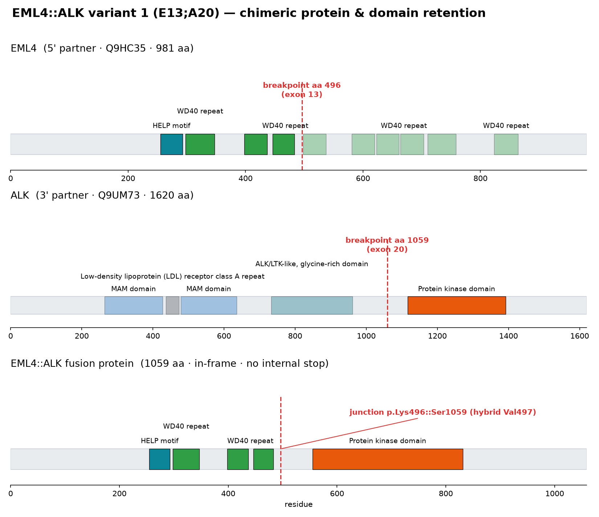

# fusion-annotation

**What this tool does, in plain terms:** when a tumor sequencing report turns up a gene
fusion — two genes fused together, like the well-known `EML4::ALK` fusion found in some
lung cancers — this tool answers two questions about it:

1. **What protein does the fusion actually make, and does it still work?**
   Fusing two genes only matters if the two halves join up "in frame" (like joining two
   sentences without garbling the words) and if the piece that survives is the
   functionally important part. For `EML4::ALK`, the tool shows that the joined protein
   reads correctly with no premature stop, and that it keeps the whole ALK **kinase**
   domain — the enzymatic "motor" that, once switched on inappropriately, drives the
   cancer. It also shows exactly which piece of each original protein is lost.
2. **What is already known about this fusion clinically?** — is it considered a driver
   of cancer, and which drugs (e.g., crizotinib, alectinib, lorlatinib for `EML4::ALK`)
   have evidence of activity against it, pulled from curated knowledgebases (CIViC,
   Open Targets) in the same open spirit as OncoKB.

The output is a short, human-readable line describing the fusion protein — for example:

> `EML4:p.Met1_Lys496::ALK:p.Tyr1059_Pro1620` — translation: *the fusion keeps the first
> 496 amino acids of EML4 and everything from position 1059 onward in ALK, including its
> intact kinase domain.*

— plus a figure like the one below, showing which parts of each parent protein are kept
(colored) versus lost (grey) in the fusion.



**Here is the tool's full output for this example** — no installation needed to read it,
this is exactly what running the bundled example prints:

```
=== EML4::ALK variant 1 (E13;A20) ===

HGVS.p-like : EML4:p.Met1_Lys496::ALK:p.Tyr1059_Pro1620  (junction hybrid codon -> Val)
categorical : EML4::ALK
frame       : in-frame  (protein 1059 aa, internal stops 0)
junction    : EML4 Lys496 :: ALK Tyr1059  (hybrid codon -> V)

retained domains:
  [RETAINED] WD40 repeat (298-347)
  [RETAINED] WD40 repeat (398-437)
  [RETAINED] WD40 repeat (446-483)
  [RETAINED] HELP motif (255-293)
  [RETAINED] Protein kinase domain (1116-1392)
  [RETAINED] Serine-threonine/tyrosine-protein kinase, catalytic domain (1116-1382)
  [RETAINED] Tyrosine-protein kinase, catalytic domain (1116-1383)
  [RETAINED] Protein kinase-like domain superfamily (1089-1381)
  [RETAINED] Tyrosine-protein kinase, receptor class II, conserved site (1276-1284)
  [RETAINED] Tyrosine-protein kinase, active site (1245-1257)
  [RETAINED] Protein kinase, ATP binding site (1122-1150)

knowledge:
  oncogenic : Oncogenic
  therapies : Alectinib, Alvespimycin, Crizotinib, Entrectinib, Erlotinib, Lorlatinib,
              Nivolumab, Retaspimycin Hydrochloride, WHI-P154
  sources   : CIViC MP 5, Open Targets ENSG00000171094
```

A few notes on reading this:
- The several near-duplicate "retained domain" lines under the kinase domain (catalytic
  domain, active site, ATP-binding site, …) all come from different InterPro entries that
  describe overlapping or nested regions of the *same* ALK kinase — that redundancy is a
  property of the underlying domain database, not an error.
- The **therapies** line mixes evidence of different strength: `crizotinib`, `alectinib`,
  and `lorlatinib` are the guideline-recognized ALK inhibitors with curated clinical
  evidence for this fusion (from CIViC); the rest of the list comes from a broader,
  less clinically curated drug-target database (Open Targets) and includes agents that
  are investigational or included for other reasons (e.g., HSP90 inhibitors, a JAK
  inhibitor). This heterogeneity is exactly the kind of thing we want feedback on — how
  should evidence tiers be separated or labeled for a clinical audience?

This is a research/informatics tool, not a diagnostic device — it is meant to support a
molecular pathologist's or genomic analyst's interpretation, not replace it. Results
should be reviewed by a qualified professional before they inform patient care.

**For non-programmers:** you don't need to run anything to give feedback — the block
above is the real output. If you do want to run it yourself, the worked example in
[`examples/eml4_alk_offline.py`](examples/eml4_alk_offline.py) reproduces it with a
single command (see Quickstart below). We're interested in feedback on whether this
output is useful and clear from a clinical/biological point of view — what would you
want to see added, removed, or presented differently?

---

## For developers

Standards-aligned **gene-fusion annotation**: a protein-effect engine (VEP-like) and
a knowledge engine (OncoKB-like), joined by an **HGVS.p-like protein-level interface**.

The core engine has **zero runtime dependencies** (Python stdlib only) and is fully
offline-testable. Live annotation sources (Ensembl, InterPro, CIViC, Open Targets)
are reached through a pluggable `DataProvider` — including an MCP-backed provider for
agentic and [Genome Nexus](https://www.genomenexus.org/) / cBioPortal workflows.

### Why

Fusion callers (STAR-Fusion, Arriba, FusionInspector, …) tell you *that* a fusion
exists. Oncogenicity scorers (OncoFuse, FusionPath, …) tell you *how likely it is to
be a driver*. Neither emits a normalized, HGVS-style protein-level description of the
**chimeric product**, nor a clean contract between the *effect* of a specific breakpoint
and the *knowledge* about a categorical gene pair. This package fills that gap:

| Layer | Analogy | Output |
|-------|---------|--------|
| 1 · Effect | VEP | chimeric protein: frame, junction, hybrid codon, retained/lost domains |
| 2 · Interface | HGVS.p / `::` | `EML4:p.Met1_Lys496::ALK:p.Tyr1059_Pro1620` + categorical key |
| 3 · Knowledge | OncoKB | oncogenicity, therapies, evidence for the gene-pair fusion |

The interface layer follows the [VICC Gene Fusion Specification](https://fusions.cancervariants.org/)
distinction between an **assayed** fusion (a specific breakpoint, annotated by Layer 1)
and a **categorical** fusion (a gene pair, keyed by Layer 3), and uses the HGVS `::`
adjoined-protein operator for the junction string.

### Install

```bash
pip install -e .            # core only, no dependencies
pip install -e ".[test]"    # + pytest
```

### Quickstart (offline)

```python
from fusion_annotation import Transcript, build_exon_cds_map, annotate_fusion
from fusion_annotation.providers import StaticProvider

# ... seed a StaticProvider (see examples/eml4_alk_offline.py) ...
result = annotate_fusion(provider, "EML4", "ALK", five_exon=13, three_exon=20)
print(result["interface"]["hgvsp_like"])
# EML4:p.Met1_Lys496::ALK:p.Tyr1059_Pro1620  (junction hybrid codon -> Val)
```

The same fusion can be specified by **genomic breakpoints** instead of exon
numbers — the coordinate is mapped through the exon table to a CDS base, which
pins the isoform (see [Why genomic breakpoints?](#why-genomic-breakpoints-the-cd74ros1-isoform-trap)):

```python
result = annotate_fusion(
    provider, "EML4", "ALK",
    five_genomic="chr2:42295516",   # 3' end of EML4 exon 13 (GRCh38)
    three_genomic="chr2:29223528",  # 5' start of ALK exon 20 (GRCh38)
)
print(result["resolved"]["five"]["breakpoint"])
# {'type': 'genomic', 'genomic_position': 42295516, 'cds_coord': 1489}
```

Run the bundled worked examples:

```bash
python examples/eml4_alk_offline.py           # exon-number breakpoints
python examples/genomic_breakpoint_offline.py # genomic breakpoints
```

### Live annotation via MCP

```python
# In a Claude Science repl cell, host.mcp is the upstream connector callable.
from fusion_annotation.providers import MCPDataProvider
from fusion_annotation import annotate_fusion

provider = MCPDataProvider(host.mcp)          # Ensembl + InterPro + CIViC
result = annotate_fusion(provider, "EML4", "ALK", five_exon=13, three_exon=20)
```

`MCPDataProvider` expects a callable with signature `mcp(server, method, **kwargs)` and
uses these upstream servers:

- **genomes** (Ensembl REST): `ensembl_lookup`, `ensembl_sequence`, `ensembl_xrefs`
- **protein-annotation** (InterPro): `get_domain_architecture`
- **clinical-genomics** (CIViC / Open Targets): `civic_search_molecular_profiles`, `civic_search_evidence`

### As an MCP tool

`fusion_annotation.mcp_tool` exposes a single `annotate_gene_fusion` tool
(`TOOL_SCHEMA` + `annotate_fusion_tool()` backend) that you can register with any MCP
server framework, so an LLM agent can annotate a fusion in one call. See the module
docstring for a FastMCP example.

### Using the deployed MCP server

A hosted copy of the server is live at:

- MCP endpoint: `https://REDACTED.a.run.app/mcp`
- Health check: `https://REDACTED.a.run.app/healthz`

To use it from Claude.ai or Claude Desktop as a remote connector:

1. Open **Settings → Connectors**.
2. Add a **custom connector** with URL `https://REDACTED.a.run.app/mcp`.
3. Connect, then call the `annotate_gene_fusion` tool.

`annotate_gene_fusion` accepts:

```json
{
  "five_gene": "EML4",
  "three_gene": "ALK",
  "five_exon": 13,
  "three_exon": 20,
  "five_genomic": null,
  "three_genomic": null,
  "five_transcript": null,
  "three_transcript": null,
  "species": "homo_sapiens"
}
```

Each partner's breakpoint may be given either as an **exon number**
(`five_exon` / `three_exon`) or as a **genomic position** (`five_genomic` /
`three_genomic` — an integer, a `"chr6:117324415"` form, or an HGVS `"g.117324415"`
term). A genomic position pins the transcript isoform and removes exon-numbering
ambiguity between overlapping isoforms; when both are supplied for a partner, the
genomic position wins.

**Example — the same EML4::ALK fusion, specified by genomic breakpoints** instead
of exon numbers (GRCh38; both partners are on chr2). Any of the three coordinate
forms below is accepted:

```json
{
  "five_gene": "EML4",
  "three_gene": "ALK",
  "five_genomic": "chr2:42295516",
  "three_genomic": "chr2:29223528"
}
```

```json
{
  "five_gene": "EML4",
  "three_gene": "ALK",
  "five_genomic": 42295516,
  "three_genomic": 29223528
}
```

```json
{
  "five_gene": "EML4",
  "three_gene": "ALK",
  "five_genomic": "g.42295516",
  "three_genomic": "g.29223528"
}
```

All three resolve to the identical junction as the exon-number call
(`five_exon: 13, three_exon: 20`) — `EML4:p.Met1_Lys496::ALK:p.Tyr1059_Pro1620`,
in-frame — because `chr2:42295516` is the 3′ end of EML4 exon 13 and
`chr2:29223528` is the 5′ start of ALK exon 20. To pin a specific isoform
explicitly, add `five_transcript` / `three_transcript`.

The bundled [`examples/genomic_breakpoint_offline.py`](examples/genomic_breakpoint_offline.py)
runs this end-to-end offline and prints the resolved breakpoints:

```text
resolved (echoed back by the tool):
  EML4  ENST00000318522 (canonical) -- genomic breakpoint g.42295516 -> CDS coord 1489
  ALK   ENST00000389048 (canonical) -- genomic breakpoint g.29223528 -> CDS coord 3173
```

The transcript fields are optional and default to each gene's canonical Ensembl
transcript. The response echoes, under a `resolved` block, the transcript actually
used for each partner and how each breakpoint was interpreted, and a `warnings`
list flags a known oncogenic gene pair that reconstructs out-of-frame (usually a
sign of a wrong exon number or isoform rather than a real frameshift):

```json
{
  "resolved": {
    "five":  {"gene": "EML4", "transcript": "ENST00000318522", "transcript_source": "canonical",
              "breakpoint": {"type": "exon", "exon": 13, "cds_coord": 1489}},
    "three": {"gene": "ALK",  "transcript": "ENST00000389048", "transcript_source": "canonical",
              "breakpoint": {"type": "exon", "exon": 20, "cds_coord": 3173}}
  },
  "warnings": []
}
```

#### Why genomic breakpoints? The CD74::ROS1 isoform trap

An exon number alone cannot name an isoform. For `CD74::ROS1`, the longer CD74
isoform `ENST00000009530` (p41-type, with an extra invariant-chain exon) numbers
its exons differently from the canonical breakpoint, so *no* CD74 exon on that
transcript reproduces the real fusion — the frame math is correct but computed for
the wrong isoform. A genomic breakpoint sidesteps this: it only resolves against
the transcript whose exon table actually spans it. Supply `five_genomic` /
`three_genomic` (and, if you want, pin the transcripts explicitly) and the tool
maps the coordinate to the exact CDS base on that isoform.

### The EML4::ALK worked example

`EML4::ALK` variant 1 (E13;A20) — EML4 exon 13 joined to ALK exon 20 — is the canonical
NSCLC driver. This package reproduces, from primary data:

- fusion CDS = 3180 nt → **in-frame**, **zero internal stops**, 1059 aa protein
- junction: EML4 contributes 496 complete codons (…Lys496); the junction codon is a
  **hybrid** (1 nt EML4 + 2 nt ALK = GTG = **Val**); ALK continues from Tyr1059
- **ALK kinase domain (1116–1392) fully retained**; EML4 second β-propeller lost →
  the mechanism: loss of ALK's extracellular/TM region + EML4-driven oligomerization
  of an intact kinase = constitutive activation

See [docs/DESIGN.md](docs/DESIGN.md) for the full architecture and rationale (the
domain-retention figure is shown at the top of this README).

### A contrasting example: same gene pair, non-functional breakpoint

Not every breakpoint within an oncogenic gene pair yields a functional fusion product.
For example, `EML4::ALK` with `E13;A29` is predicted to be **frameshift-truncating**,
and the critical ALK kinase domain is **not retained intact**:

```text
HGVS.p-like : EML4:p.Met1_Lys496::ALK:p.Asp1389_Pro1417  (junction hybrid codon -> Gly)
categorical : EML4::ALK
frame       : frameshift-truncating  (protein 526 aa, internal stops 0)

retained domains:
  [RETAINED] WD40 repeat (298-347)
  [RETAINED] WD40 repeat (398-437)
  [RETAINED] WD40 repeat (446-483)
  [RETAINED] HELP motif (255-293)

lost / disrupted critical ALK features:
  [DISRUPTED] Protein kinase domain (1116-1392)
  [LOST] Tyrosine-protein kinase, active site (1245-1257)
  [LOST] Protein kinase, ATP binding site (1122-1150)
```

This is exactly why the package separates the **assayed** fusion effect (specific
breakpoint, Layer 1) from the **categorical** gene-pair knowledge (Layer 3): the
same `EML4::ALK` label can map to a clinically important driver breakpoint or to a
protein product that is unlikely to be functional.

### Tests

```bash
pytest            # 11 offline assertions against the EML4::ALK truth values
```

### Status & roadmap

v0.1 handles exon-boundary **and** genomic-coordinate breakpoints (the latter map
through the exon table to an exact CDS base, pinning the isoform — see issue #3),
echoes the resolved transcript per partner, and flags known oncogenic pairs that
come back out-of-frame. Planned: all-transcript enumeration, NMD prediction, full
VICC GFS JSON schema + GA4GH VRS/Cat-VRS identifiers, `hgvs` library round-trip
validation, and a proper OncoKB backend. See docs/DESIGN.md §6.

### License

Apache-2.0 (see [LICENSE](LICENSE))
